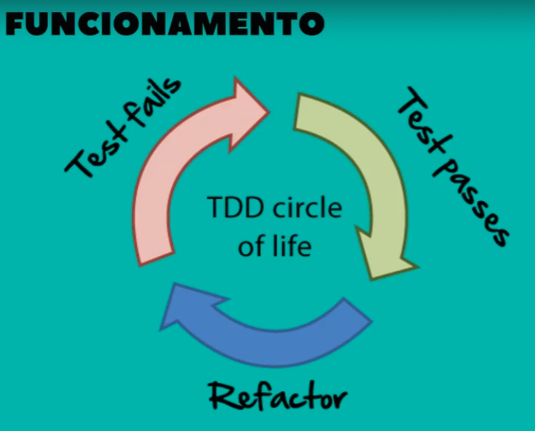

# Repositorio do curso de TDD com xUnit para C# .NET Core

## Escopo da aplicação:
### Entidades:
 Curso
 Deverá ter os campos nome,carga horária, público alvo e valor
  Não deverá repetir o nome do curso
 
 Aluno
 Campos: nome, CPF, data de nascimento, seu público alvo
 Não deve permitir salvar dois CPFs iguais
 
 Matricula
 Campos: curso, aluno, valor pago
 Aluno não deve afetuar uma matricula, caso a primeira esteja aberta
 Alguns aluno não pagam o valor do curso cheio, nesse caso é dado um desconto. Porém o nunca aluno deverá pagar mais do que o valor do curso
 No momento da matricula, o público alvo do curso e aluno devem ser o mesmo

### TDD (Test Driven Development) - Desenvolvimento Orientado por Testes 

É uma abordagem para escrever os testes antes mesmo de desenvolver o código do software

<h2> Benefícios: </h2>
 1 - Ser executado a todo o momento (feedback rápidos)
 2 - Qualidade de código (pode validar se a entrada está correta com a saída)
 3 - Documentação (Criando teste e cénarios você aprenderá a documentar os passo a passo do método ou regra)
 
